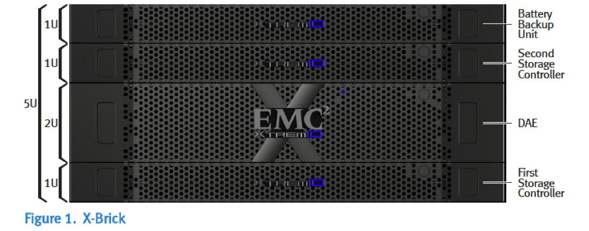
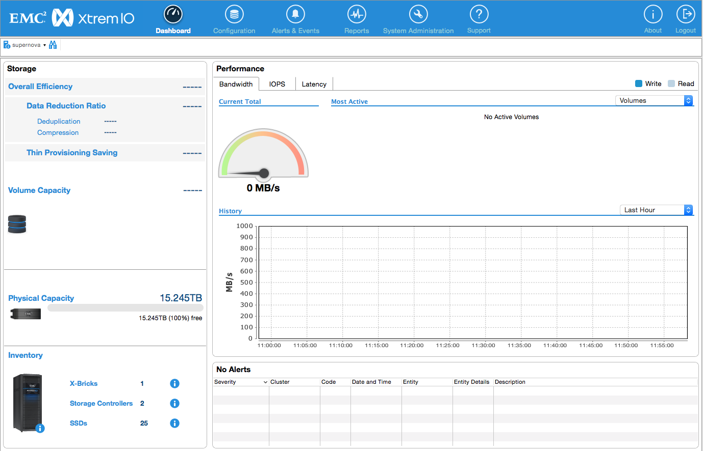
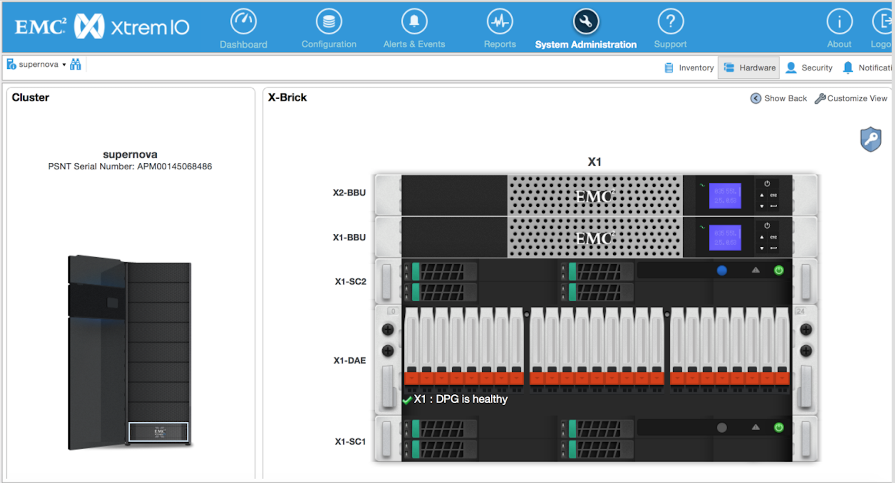

=========
Test Plan
=========

**For XtremIO Fuel Plugin 3.0.0 & Mirantis OpenStack 9.0**

Revision history
----------------

+---------------+---------------------+------------------------+--------------------+
| **Version**   | **Revision date**   | **Editor**             | **Comment**        |
+===============+=====================+========================+====================+
| 0.1           | 07.09.2016          | Eric Caron             | Initial version.   |
|               |                     |                        |                    |
|               |                     | (eric.caron@emc.com)   |                    |
+---------------+---------------------+------------------------+--------------------+

**XtremIO Plugin**

Executive Overview
------------------

Flash storage is an attractive method for boosting I/O performance in
the data center.

But it has always come at a price, both in high costs and loss of
capabilities like scalability, high availability, and enterprise
features.

XtremIO's 100% flash-based scale-out enterprise storage array delivers
not only high levels of performance and scalability, but also brings new
levels of ease-of-use to SAN storage, while offering advanced features
that have never been possible before.

XtremIO's ground-up all-flash array design was created from the start
for maximum performance and consistent low latency response times, and
with enterprise grade high availability features, real-time Inline Data
Reduction that dramatically lowers costs, and advanced functions such as
thin provisioning, tight integration to VMware, snapshots, volume
clones, and superb data protection.

This is achieved with a competitive cost of ownership. The product
architecture addresses all the requirements for flash-based storage,
including achieving longevity of the flash media, lowering the effective
cost of flash capacity, delivering performance and scalability,
providing operational efficiency, and delivering advanced storage array
functionality.

XtremIO Components
------------------

The XtremIO Storage Array is an all-flash system, based on a scale-out
architecture.

The system uses building blocks, called X-Bricks, which can be clustered
together to grow performance and capacity as required.

The system operation is controlled via a stand-alone dedicated
Linux-based server, called the XtremIO Management Server (XMS). Each
XtremIO cluster requires its own XMS host, which can be either a
physical or a virtual server. The array continues operating if it is
disconnected from the XMS, but cannot be configured or monitored.

XtremIO's array architecture is specifically designed to deliver the
full performance potential of flash, while linearly scaling all
resources such as CPU, RAM, SSDs, and host ports in a balanced manner.
This allows the array to achieve any desired performance level, while
maintaining consistency of performance that is critical to predictable
application behavior.

The XtremIO Storage System provides a very high level of performance
that is consistent over time, system conditions and access patterns. It
is designed for high granularity (4KB) true random I/O.

The system's performance level is not affected by its capacity
utilization level, number of volumes, or aging effects. Moreover,
performance is not based on a "shared cache" architecture and therefore
it is not affected by the dataset size or data access pattern.

Due to its content-aware storage architecture, XtremIO provides:

-  Even distribution of data blocks, inherently leading to maximum
   performance and minimal flash wear

-  Even distribution of metadata

-  No data or metadata hotspots

-  Easy setup and no tuning

-  Advanced storage functionality, including Inline Data Reduction, thin
   provisioning, advanced data protection (XDP), snapshots, and more

An X-Brick is the basic building block of an XtremIO array.

-  Each X-Brick is comprised of:

-  One 2U Disk Array Enclosure (DAE), containing:

   -  25 eMLC SSDs

   -  Two redundant power supply units (PSUs)

   -  Two redundant SAS interconnect modules

-  One Battery Backup Unit

-  Two 1U Storage Controllers (redundant storage processors)

Each Storage Controller includes:

-  Two redundant power supply units (PSUs)

-  Two 8Gb/s Fibre Channel (FC) ports

-  Two 10GbE iSCSI ports

-  Two 40Gb/s InfiniBand ports

-  One 1Gb/s management/IPMI port

XtremIO Cinder and Nova Drivers
-------------------------------

XtremIO includes a Cinder driver, which interfaces between XtremIO and
OpenStack, and presents volumes to OpenStack as block devices, which are
available for block storage. It also includes an OpenStack Nova driver,
for handling compute and instance volume related operations. The XtremIO
driver executes volume operations by communicating with the backend
XtremIO Management Server (XMS) APIs.

Developer’s specification
-------------------------

Is available on
`*GitHub repository* <https://github.com/carone1/fuel-xtremio>`__

Limitations
-----------

There are following limitations in plugin functionality:

Test strategy
-------------

The XtremIO plugin creates a GUI element to collect the information
necessary to deploy and configure EMC XtremIO in Open Stack
controller/storage nodes. The testing strategy is to confirm that all
options in the GUI are handled properly and Cinder and Nova are properly
configure to use an XtremIO cluster as the block storage service.

Acceptance criteria
-------------------

All tests should pass.

Test environment, infrastructure and tools
------------------------------------------

The test lab should include 4 nodes. The following designations for the
nodes:

Each node shall have at least 2 CPUs, 4GB RAM, 80GB disks, 3 Network
interfaces. The 3 interfaces will be used for the following purposes:

In order to perform management operations with XtremIO cluster there is
an XtremIO Storage Management application. It is a management tool that
is available on all XMS nodes after deployment. Point your browser to
and download the XtremIO Storage Management application.

How to do checks with the XtremIO Storage Management application:

1) Verify that there aren’t any alerts on the XtremIO dashboard

2) Ensure all h/w indicator are in a good state

Product compatibility matrix
----------------------------

+--------------------------+---------------------------+----------------------------+-------------------+
| XtremIO Plugin version   | Compatible Fuel version   | OpenStack and OS Version   | XtremIO version   |
+==========================+===========================+============================+===================+
| 3.0.0                    | 9.0                       | Mitaka on Ubuntu14.04      | 4.2 build 34      |
+--------------------------+---------------------------+----------------------------+-------------------+

System Testing
--------------

Install plugin and deploy environment
-------------------------------------

+-------------------+----------------------------------------------------------------------------------+
| Test Case ID      | install\_plugin\_deploy\_env                                                     |
+===================+==================================================================================+
| Steps             | Upload plugin to the master fuel node                                            |
|                   |                                                                                  |
|                   | Install plugin                                                                   |
|                   |                                                                                  |
|                   | Ensure that plugin is installed successfully using cli                           |
|                   |                                                                                  |
|                   | Create environment with enabled XtremIO plugin in fuel UI                        |
|                   |                                                                                  |
|                   | Select checkbox \`EMC XtremIO driver for Cinder\` under Settings other           |
|                   |                                                                                  |
|                   | Specify \`XMS username\`                                                         |
|                   |                                                                                  |
|                   | Specify \`XMS password\`                                                         |
|                   |                                                                                  |
|                   | Specify \`XMS IP\`                                                               |
|                   |                                                                                  |
|                   | Specify \`XtremIO Cluster Name\` if XMS manages multiple clusters                |
|                   |                                                                                  |
|                   | Add 3 node with Controller and Cinder role                                       |
|                   |                                                                                  |
|                   | Add 1 node with Compute role                                                     |
|                   |                                                                                  |
|                   | Apply network settings                                                           |
|                   |                                                                                  |
|                   | IP addresses and assigning networks to interfaces depending on                   |
|                   | actual network environment of test lab                                           |
|                   |                                                                                  |
|                   | Run network verification                                                         |
|                   |                                                                                  |
|                   | Deploy the cluster                                                               |
|                   |                                                                                  |
|                   | Login to Horizon with the admin user when the OpenStack deployment is finished   |
|                   |                                                                                  |
|                   | Create volume using \`TestVM\` image                                             |
|                   |                                                                                  |
|                   | Create empty 1GB volume                                                          |
|                   |                                                                                  |
|                   | Create/Run instance using volume created with TestVM image                       |
|                   |                                                                                  |
|                   | Delete volumes and instances created above                                       |
|                   |                                                                                  |
|                   | Run OSTF tests                                                                   |
+-------------------+----------------------------------------------------------------------------------+
| Expected Result   | Plugin is installed successfully, cluster is created, network verification.      |
|                   |                                                                                  |
|                   | XtremIO cluster has:                                                             |
|                   |                                                                                  |
|                   | One empty 1GB volume                                                             |
|                   |                                                                                  |
|                   | One volume matching TestVM image size                                            |
|                   |                                                                                  |
|                   | Volume and instance are created and deleted successfully via Horizon.            |
|                   |                                                                                  |
|                   | OSTF are passed. Tests with launch of instances should be excluded because       |
|                   | they require special flavor.                                                     |
+-------------------+----------------------------------------------------------------------------------+

Modifying env with enabled plugin (removing/adding controller nodes)
--------------------------------------------------------------------

+-------------------+----------------------------------------------------------------------------------+
| Test Case ID      |     modify\_env\_with\_plugin\_remove\_add\_controller\_storage                  |
+===================+==================================================================================+
| Environment       | Fuel master node (w 50GB Disk, 2 Network interfaces [Mgmt, PXE] )                |
|                   |                                                                                  |
|                   | OpenStack Controller #1 node                                                     |
|                   |                                                                                  |
|                   | OpenStack Controller #2 node                                                     |
|                   |                                                                                  |
|                   | OpenStack Controller #3 node                                                     |
|                   |                                                                                  |
|                   | OpenStack Compute                                                                |
|                   |                                                                                  |
|                   | Network and disks configuration is the same as described in common section       |
+-------------------+----------------------------------------------------------------------------------+
| Steps             | Upload plugin to the master fuel node                                            |
|                   |                                                                                  |
|                   | Install plugin                                                                   |
|                   |                                                                                  |
|                   | Ensure that plugin is installed successfully using cli                           |
|                   |                                                                                  |
|                   | Create environment with enabled XtremIO plugin in fuel UI                        |
|                   |                                                                                  |
|                   | Select checkbox \`EMC XtremIO driver for Cinder\` under Settings/other           |
|                   |                                                                                  |
|                   | Specify \`XMS username\` \`XMS password\` \`XMS IP\`                             |                           |
|                   |                                                                                  |
|                   | Specify \`XtremIO Cluster Name\` if XMS manages multiple clusters                |
|                   |                                                                                  |
|                   | Add 3 nodes with Controller & Cinder roles                                       |
|                   |                                                                                  |
|                   | Add 1 node with Compute role                                                     |
|                   |                                                                                  |
|                   | Apply network settings                                                           |
|                   |                                                                                  |
|                   | IP addresses and assigning networks to interfaces depending on actual            |
|                   | network environment of test lab                                                  |
|                   |                                                                                  |
|                   | Run network verification and deploy cluster                                      |
|                   |                                                                                  |
|                   | Run OSTF tests                                                                   |
|                   |                                                                                  |
|                   | Login to Horizon with the admin user when the OpenStack deployment is finished   |
|                   |                                                                                  |
|                   | Create volume using \`TestVM\` image                                             |
|                   |                                                                                  |
|                   | Create empty 1GB volume                                                          |
|                   |                                                                                  |
|                   | Create/Run instance using volume created with TestVM image                       |
|                   |                                                                                  |
|                   | Delete volumes and instances created above                                       |
|                   |                                                                                  |
|                   | Remove 1 Controller/Cinder node.                                                 |
|                   |                                                                                  |
|                   | Re-deploy cluster and run OSTF Tests                                             |
|                   |                                                                                  |
|                   | Login to Horizon with the admin user when the OpenStack deployment is finished   |
|                   |                                                                                  |
|                   | Create volume using \`TestVM\` image                                             |
|                   |                                                                                  |
|                   | Create empty 1GB volume                                                          |
|                   |                                                                                  |
|                   | Create/Run instance using volume created with TestVM image                       |
|                   |                                                                                  |
|                   | Delete volumes and instances created above                                       |
|                   |                                                                                  |
|                   | Add 1 new node with Controller &Cinder roles                                     |
|                   |                                                                                  |
|                   | Re-deploy cluster  and run OSTF tests                                            |
|                   |                                                                                  |
|                   | Login to Horizon with the admin user when the OpenStack deployment is finished   |
|                   |                                                                                  |
|                   | Create volume using \`TestVM\` image                                             |
|                   |                                                                                  |
|                   | Create empty 1GB volume                                                          |
|                   |                                                                                  |
|                   | Create/Run instance using volume created with TestVM image                       |
|                   |                                                                                  |
|                   | Delete volumes and instances created above                                       |
+-------------------+----------------------------------------------------------------------------------+
| Expected Result   | Plugin is installed successfully, cluster is created, network verification.      |
|                   |                                                                                  |
|                   | XtremIO cluster has:                                                             |
|                   |                                                                                  |
|                   | One empty 1GB volume                                                             |
|                   |                                                                                  |
|                   | One volume matching TestVM image size                                            |
|                   |                                                                                  |
|                   | Volume and instance are created and deleted successfully via Horizon.            |
|                   |                                                                                  |
|                   | OSTF are passed.                                                                 |
+-------------------+----------------------------------------------------------------------------------+

Modifying env with enabled plugin (removing/adding compute node)
----------------------------------------------------------------

+-------------------+----------------------------------------------------------------------------------+
| Test Case ID      |     modify\_env\_with\_plugin\_remove\_add\_compute                              |
+===================+==================================================================================+
| Environment       | Fuel master node (w 50GB Disk, 2 Network interfaces [Mgmt, PXE] )                |
|                   |                                                                                  |
|                   | OpenStack Controller #1 node                                                     |
|                   |                                                                                  |
|                   | OpenStack Controller #2 node                                                     |
|                   |                                                                                  |
|                   | OpenStack Controller #3 node                                                     |
|                   |                                                                                  |
|                   | OpenStack Compute                                                                |
|                   |                                                                                  |
|                   | Network and disks configuration is the same as described in common section       |
+-------------------+----------------------------------------------------------------------------------+
| Steps             | Upload plugin to the master fuel node                                            |
|                   |                                                                                  |
|                   | Install plugin                                                                   |
|                   |                                                                                  |
|                   | Ensure that plugin is installed successfully using cli                           |
|                   |                                                                                  |
|                   | Create environment with enabled XtremIO plugin in fuel UI                        |
|                   |                                                                                  |
|                   | Select checkbox \`EMC XtremIO driver for Cinder\` under Settings/other           |
|                   |                                                                                  |
|                   | Specify \`XMS username\`                                                         |
|                   |                                                                                  |
|                   | Specify \`XMS password\`                                                         |
|                   |                                                                                  |
|                   | Specify \`XMS IP\`                                                               |
|                   |                                                                                  |
|                   | Specify \`XtremIO Cluster Name\` if XMS manages multiple clusters                |
|                   |                                                                                  |
|                   | Add 3 nodes with Controller & Cinder roles                                       |
|                   |                                                                                  |
|                   | Add 1 node with Compute role                                                     |
|                   |                                                                                  |
|                   | Apply network settings                                                           |
|                   |                                                                                  |
|                   | IP addresses and assigning networks to interfaces depending on actual            |
|                   | network environment of test lab                                                  |
|                   |                                                                                  |
|                   | Run network verification                                                         |
|                   |                                                                                  |
|                   | Deploy the cluster                                                               |
|                   |                                                                                  |
|                   | Run OSTF tests                                                                   |
|                   |                                                                                  |
|                   | Login to Horizon with the admin user when the OpenStack deployment is finished   |
|                   |                                                                                  |
|                   | Create volume using \`TestVM\` image                                             |
|                   |                                                                                  |
|                   | Create empty 1GB volume                                                          |
|                   |                                                                                  |
|                   | Create/Run instance using volume created with TestVM image                       |
|                   |                                                                                  |
|                   | Delete volumes and instances created above                                       |
|                   |                                                                                  |
|                   | Remove Compute node.                                                             |
|                   |                                                                                  |
+-------------------+----------------------------------------------------------------------------------+

+-------------------+----------------------------------------------------------------------------------+
| Test Case ID      |     modify\_env\_with\_plugin\_remove\_add\_compute cont                         |
+===================+==================================================================================+
| Steps Continue    | Re-deploy cluster                                                                |
|                   |                                                                                  |
|                   | Run OSTF tests                                                                   |
|                   |                                                                                  |
|                   | Login to Horizon with the admin user when the OpenStack deployment is finished   |
|                   |                                                                                  |
|                   | Create volume using \`TestVM\` image                                             |
|                   |                                                                                  |
|                   | Create empty 1GB volume                                                          |
|                   |                                                                                  |
|                   | Create/Run instance using volume created with TestVM image                       |
|                   |                                                                                  |
|                   | Delete volumes and instances created above                                       |
|                   |                                                                                  |
|                   | Add new node with Compute role                                                   |
|                   |                                                                                  |
|                   | Re-deploy cluster                                                                |
|                   |                                                                                  |
|                   | Run OSTF tests                                                                   |
|                   |                                                                                  |
|                   | Login to Horizon with the admin user when the OpenStack deployment is finished   |
|                   |                                                                                  |
|                   | Create volume using \`TestVM\` image                                             |
|                   |                                                                                  |
|                   | Create empty 1GB volume                                                          |
|                   |                                                                                  |
|                   | Create/Run instance using volume created with TestVM image                       |
|                   |                                                                                  |
|                   | Delete volumes and instances created above                                       |
+-------------------+----------------------------------------------------------------------------------+
| Expected Result   | Plugin is installed successfully, cluster is created, network verification.      |
|                   |                                                                                  |
|                   | XtremIO cluster has:                                                             |
|                   |                                                                                  |
|                   | One empty 1GB volume                                                             |
|                   |                                                                                  |
|                   | One volume matching TestVM image size                                            |
|                   |                                                                                  |
|                   | Volume and instance are created and deleted successfully via Horizon.            |
|                   |                                                                                  |
|                   | OSTF are passed.                                                                 |
+-------------------+----------------------------------------------------------------------------------+

Uninstall of plugin with deployed environment
---------------------------------------------

+-------------------+----------------------------------------------------------------------------------+
| Test Case ID      | uninstall\_plugin\_with\_deployed\_env                                           |
+===================+==================================================================================+
| Steps             | Install plugin                                                                   |
|                   |                                                                                  |
|                   | Deploy environment with enabled plugin functionality                             |
|                   |                                                                                  |
|                   | Run OSTF tests                                                                   |
|                   |                                                                                  |
|                   | Try to delete plugin and ensure that present in cli alert :                      |
|                   | "400 Client Error: Bad Request"                                                  |
|                   | "Can't delete plugin which is enabled for some environment."                     |
|                   |                                                                                  |
|                   | Remove environment                                                               |
|                   |                                                                                  |
|                   | Remove plugin                                                                    |
|                   |                                                                                  |
|                   | Check that it was successfully removed                                           |
+-------------------+----------------------------------------------------------------------------------+
| Expected Result   | Plugin was installed successfully.                                               |
|                   |                                                                                  |
|                   | Alert present when trying to delete plugin attached to environment.              |
|                   |                                                                                  |
|                   | Plugin is removed when environment is reset                                      |
+-------------------+----------------------------------------------------------------------------------+

Uninstall of plugin
-------------------

+-------------------+------------------------------------------------------+
| Test Case ID      | uninstall\_plugin                                    |
+===================+======================================================+
| Steps             | Install plugin                                       |
|                   |                                                      |
|                   | Check that it was installed successfully             |
|                   |                                                      |
|                   | Remove plugin                                        |
|                   |                                                      |
|                   | Check that it was successfully removed               |
+-------------------+------------------------------------------------------+
| Expected Result   | Plugin was installed and then removed successfully   |
+-------------------+------------------------------------------------------+

Upgrade/update
--------------

Apply maintenance updates to deployed environment
-------------------------------------------------

+-------------------+----------------------------------------------------------------------------------+
| Test Case ID      |     apply\_mu                                                                    |
+===================+==================================================================================+
| Steps             | Install plugin                                                                   |
|                   |                                                                                  |
|                   | Deploy environment with enabled plugin functionality                             |
|                   |                                                                                  |
|                   | Run OSTF tests                                                                   |
|                   |                                                                                  |
|                   | Once environment is deployed, apply maintenance updates following                |
|                   | `*the instructions.*                                                             |
|                   | <https://docs.mirantis.com/openstack/fuel/fuel-8.0/                              |
|                   | maintenance-updates.html%23maintenance-updates>`__                               |
|                   |                                                                                  |
|                   | Make sure all nodes are in ready state and no regression is observed.            |
|                   |                                                                                  |
|                   | Run OSTF tests                                                                   |
+-------------------+----------------------------------------------------------------------------------+
| Expected Result   | Plugin is installed successfully at the Fuel Master node                         |
|                   | and the corresponding output appears in the CLI.                                 |
|                   |                                                                                  |
|                   | Cluster is created and network verification check is passed.                     |
|                   |                                                                                  |
|                   | Plugin is enabled and configured in the Fuel Web UI.                             |
|                   |                                                                                  |
|                   | OSTF tests (Health Checks) are passed.                                           |
|                   |                                                                                  |
|                   | Environment is deployed successfully.                                            |
|                   |                                                                                  |
|                   | Maintenance Updates do not affect running services                               |
|                   | related to the plugin (e.g. the services aren't restarted).                      |
|                   |                                                                                  |
|                   | Cluster remains in the fully operational state after applying                    |
|                   | Maintenance Updates.                                                             |
+-------------------+----------------------------------------------------------------------------------+

+---------+--------------------------------------------------------------------------------------------+
| **no**   | **Resource title**                                                                        |
+=========+============================================================================================+
| 1       | `XtremIO Fuel Plugin GitHub Repository <https://github.com/carone1/fuel-xtremio>`__        |
+---------+--------------------------------------------------------------------------------------------+
| 2       | `Introduction to XtremIO Guide                                                             |
|         | <https://support.emc.com/                                                                  |
|         | docu50574_White-Paper:-Introduction-to-the-EMC-XtremIO-All-Flash-Array.pdf>`__             |
+---------+--------------------------------------------------------------------------------------------+
| 3       | `XtremIO Mitaka Open Stack Cinder Driver Guide                                             |
|         | <http://docs.openstack.org/mitaka/                                                         |
|         | config-reference/block-storage/drivers/emc-xtremio-driver.html>`__                         |
+---------+--------------------------------------------------------------------------------------------+
